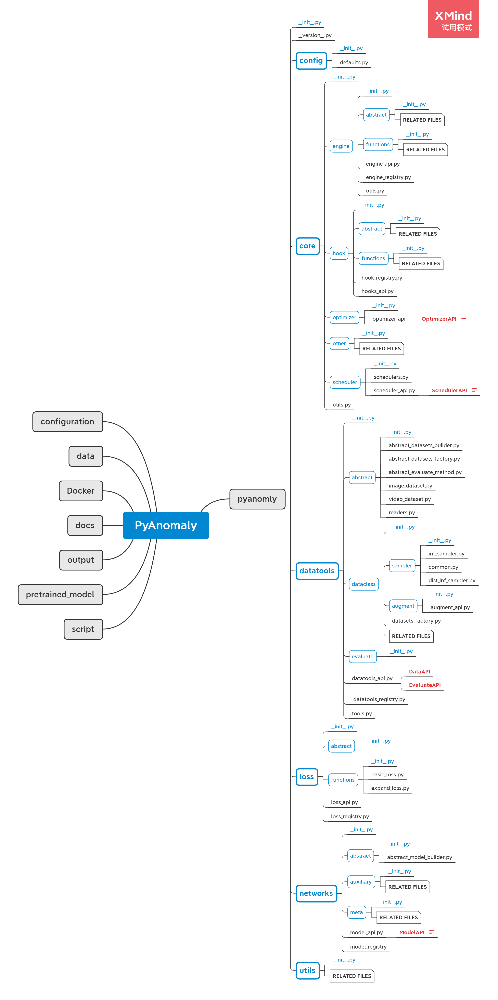

### Introduction
Video Anomaly detection is an essential task in the CV and has a wide application in surveillance. However, we do not have a repo like [detectron2](https://github.com/facebookresearch/detectron2) or [mmdet](https://github.com/open-mmlab/mmdetection), which gather the useful reproduction of algorithms. We think the challenges cause this are:
1. The algorithms of anomaly detections are not explicitly divided
2. The algorithms do not have the unified framework

In order to solve these problems and push the development of the video anomaly detection, we develop this repo. Because this is the first repo to do this, we have lots of deficient and we hope the researchers can help us to improve this repo together. During making this project, we make reference to other tasks repo, such as `detectron2` to make ours repo as flexible as possible, which is convenient for adding new features. We will introduce the repo as follows. 

### Project Structure

#### Function of each packages
The core packages are in the lib package. We build the packages explicitly inside lib based on the general functions of the ***Anomaly Detection\***, which are `config`, `core`, `datatools`,`loss`, `networks`, and `utils`. Expect these packages in lib. The other folders are not python packages, which are the folder to store user data, such as data folder is to store data, `experiment` folder is to store configurations, and the `output` is to store the log files, models, and so on.

Not for this project, this kind of project structure can be used in other CV projects, so we also provide a tool to build the project efficiently. Please refer to the [EasyBuildProject](https://github.com/YuhaoCheng/EasyBuildProject) 

##### Config
This package only contains one file `config.py`, which defines default configuration. During the real using process, we merely change this file. We only change the `YAML` files in `experiments`.

##### Core
This package contains the core functions of the whole project, which are the fixed training and inference methods. Each file is the individual trainer or inference for a method, which designs in modular. Not only the individual methods, but this part also contains the `hook` and `optimizer` and `scheduler`, which are used in the training or inference processed. The detail methods to register `hook` are in [USAGE](./usage.md).

##### Datatools
This package contains the core code of the data part, including reading the data and augmenting it. If researchers and engineers want to build their Dataset, please refer to the [USAGE](./usage.md). This package also contains the augmentation part and evaluation part. 

##### Loss

This package contains the loss functions used in our project, and users can make their loss functions. The detail methods to register the loss functions are in [USAGE](./usage.md).

##### Networks

This package contains the model structure of the whole project. The detail methods to register networks are in [USAGE](./usage.md).

##### Utils
This package includes the tools we often use in the whole project, such as receiving the CMD parameters, creating the loggers, creating the tensorboard, and so on. Most of the time, the users do not need to change the files in this package.

### APIs

To increase the flexibility of the repo, we make the following APIs to control the different training and inference. [**API(Application Programming Interface)** is a computing interface that defines interactions between multiple software intermediaries](https://en.wikipedia.org/wiki/Application_programming_interface). We use this concept to represent the plastic parts that help users to create their components in our project. These APIs show the main.py to build the components used in the training or inference process. We will introduce each API based on the order in which they appear in `main.py`.

#### ModelAPI

***Providing the network of each model.*** After registering models in the `model` package, users can get the model based on the name registered in the package. This API will use the model name in the configuration file. 

#### LossAPI

***Providing loss functions.*** After registering loss functions in the `loss` package, users can get the loss function based on the name which is registered in the package. This API will use the loss name and other parameters related to the loss functions in the configuration file. 

#### OptimizerAPI

***Providing optimizers of models' parameters.*** After registering optimizers in the `optimizer` package, users can get the optimizer based on the name which is registered in the package. This API will use the optimizer name and other parameters related to the optimizer in the configuration file.  At present, we only support the `adam` and `sgd`, and we have make them ready to use. 

#### SchedulerAPI

***Providing learning rate scheduler of optimizers.*** After registering schedulers in the `scheduler` package, users can get the optimizer based on the name which is registered in the package. This API will use the optimizer name and other parameters related to the optimizer in the configuration file. Same as the OptimizerAPI, at present we limit the function of adding new schedulers and we will develop the function in the future. 

#### AugmentAPI

***Providing data augmentation.*** This API builds a pipeline to process the data based on the configuration file. Although the OpenCV and Torchvison are good enough to build the general data augmentation, we choose [imgaug](https://github.com/aleju/imgaug), which provides a convenient way to build the augmentation pipeline as the primary augmentation. This API will use the augmentation name and other parameters related to data augmentation in the configuration file.

#### DataAPI

***Providing the dataloader based on the dataset class and data augmentation.*** After registering datasets in the `datatools` package, users can get the dataloader based on the name which is registered in the package. This API will use the dataset name and other parameters related to the dataset in the configuration file. The dataloder will contain the data augmentation methods. 

#### EvaluateAPI
Providing evaluation functions. The anomaly detection has various score computation ways based on different methods, so we create this API to make the evaluation components based on the configuration file. After registering evaluation functions in the `evaluate` package, users can get the evaluation methods based on the name which is registered in the package. 

#### HookAPI

Providing the Hooks. The Hooks are defining the details operations in the process. After registering hooks in the hooks package, users can get the hooks based on the name which is registered in the package. This API will use the hook name in the configuration file. 

